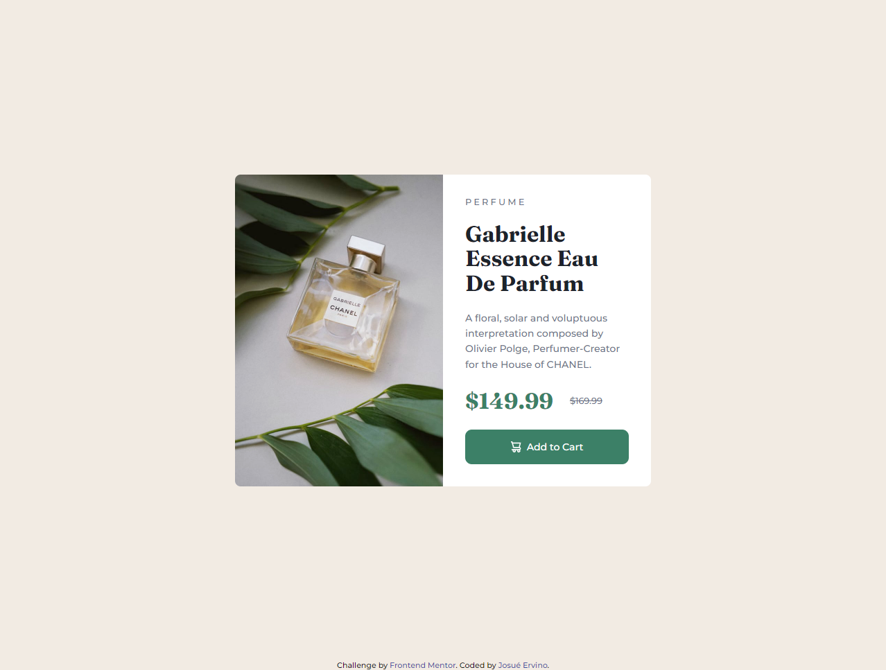

# Frontend Mentor - Product preview card component solution

Essa é uma solução para a [Product preview card component challenge on Frontend Mentor](https://www.frontendmentor.io/challenges/product-preview-card-component-GO7UmttRfa).
Os desafios do Frontend Mentor ajudam você a melhorar suas habilidades de codificação criando projetos realistas.

## Table of contents

- [Resumo](#Resumo)
  - [O Desafio](#the-challenge)
  - [Screenshot](#screenshot)
  - [Links](#links)
- [Meu Processo](#my-process)
  - [Desenvolvido com](#built-with)
  - [O que eu Aprendi](#what-i-learned)
- [Autor](#Autor)

## Resumo

### O Desafio

Usuários devem ser capazes de:

- Ver o layout ideal dependendo do tamanho da tela do dispositivo deles
- Ver estados de foco e hover para elementos interativos

### Screenshot

### Links

- URL da solução: [Clique aqui!](https://www.frontendmentor.io/solutions/product-preview-card-component-JHE6mqOau1)
- Demo: [Clique aqui!](https://josueervino.github.io/product-preview-card-component-main/)

## Meu processo

### Desenvolvido com

- Semantic HTML5 markup
- Vanilla CSS custom properties
- Flexbox
- CSS Grid
- Mobile-first workflow

### O que eu Aprendi

Eu tenho alguma experiência com desenvolvimento front-end trabalhando como desenvolvedor full stack em um projeto, embora minha formação seja principalmente com desenvolvimento back-end. Nesse projeto, consegui brincar bastante com flexbox e diferentes tamanhos no projeto, tentando alinhar cada componente da página com as imagens disponíveis. Estou bastante satisfeito com os resultados. Além disso, é a primeira vez que crio algo com a estratégia mobile-first, e percebo quão mais fácil é criar o layout e tornar seu aplicativo responsivo.

## Autor

- Website - [My github page](https://github.com/JosueErvino)
- Frontend Mentor - [@JosueErvino](https://www.frontendmentor.io/profile/JosueErvino)
